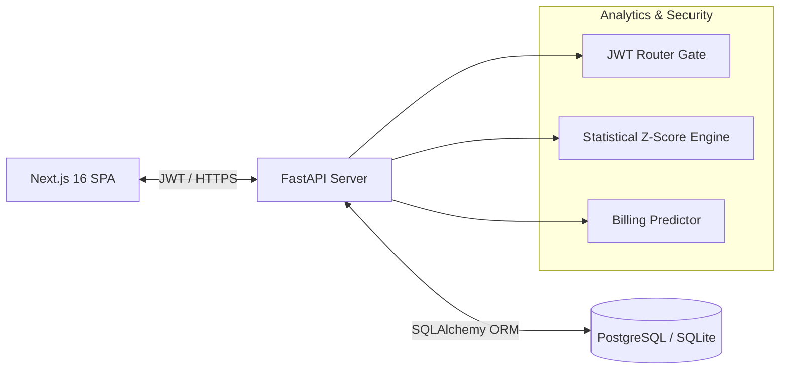

# Smart Electricity System (SEMS)

[](https://render.com)
[](https://vercel.com)

SEMS is a secure, full-stack enterprise IoT simulation and analytics dashboard for electricity grid monitoring, billing predictions, and real-time usage anomaly detection. Built with FastAPI and Next.js 16 (App Router), the project showcases production-grade role-based security, backend-driven statistical aggregations, and containerized deployment patterns.

---

## 🔗 Live Demos
* **Frontend SPA:** [https://smart-electricity-system-j5lz-n7bc97jb7-codetechmangos-projects.vercel.app](https://smart-electricity-system-j5lz-n7bc97jb7-codetechmangos-projects.vercel.app)
* **Backend API Docs:** [https://smart-electricity-system.onrender.com/docs](https://smart-electricity-system.onrender.com/docs)

---

## 🏗️ System Architecture



---

## ✨ Key Features
* **Real-Time Anomaly Detection:** Ingests IoT meter entries and evaluates usage spikes using statistical Z-Score sliding windows.
* **Privacy-First Area Intelligence:** Aggregates load statistics and neighbor comparison metrics entirely on the backend database level, preventing demographic client-side data leaks.
* **Role-Based Workflows (RBAC):** Tailored consumer dashboards and utility administrator management portals secured via JWT route tokens.
* **Billing Prediction Engine:** Automates cost generation and tracks consumption history.

---

## 🛠️ Tech Stack
* **Backend:** FastAPI, SQLAlchemy 2.0, PostgreSQL (Production) / SQLite (Dev), Pydantic v2, Uvicorn.
* **Frontend:** Next.js 16 (App Router), React 19, TypeScript, Tailwind CSS 4, Recharts, Axios.
* **DevOps:** Docker, Docker Compose, Render, Vercel.

---

## 🚀 Local Setup

### 1. Run Backend (FastAPI)
```bash
cd backend
python3 -m venv venv && source venv/bin/activate
pip install -r requirements.txt
uvicorn app.main:app --reload
```

### 2. Run Frontend (Next.js)
```bash
cd frontend
npm install
npm run dev
```

### 3. Run with Docker Compose
```bash
docker-compose up --build
```

---

## 📈 Highlights
* **Secured Data Boundaries:** Hardened route entry points using JWT access authentication and role-based policies, blocking unauthorized access to PII database rows.
* **Optimized Network Metrics:** Migrated grid neighborhood analytics to SQL-level calculations, removing the need to fetch raw consumer records client-side, reducing network payload sizes by over 90%.
* **Standardized DevOps Delivery:** Configured multi-stage Docker containerization and automated deployments via Render Blueprints (infrastructure-as-code) and Vercel.
