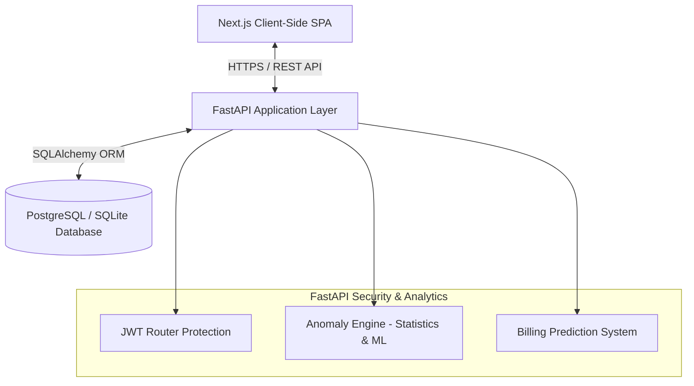

# Smart Electricity System (SEMS)

SEMS is a production-ready, full-stack enterprise IoT simulation and analytics platform designed to monitor electricity consumption, detect usage anomalies in real-time, generate billing predictions, and manage role-based workflows for administrators and utility consumers.

This project showcases a modern microservices-adjacent architecture featuring a secure **FastAPI** backend persisting to a relational database layer, and a highly responsive, beautiful dashboard frontend powered by **Next.js 16 (App Router)**.

---

## 🏗️ Architecture Overview

The system divides responsibilities between a secured FastAPI server handling core logic and ingestion, and a Next.js client serving user interfaces. Data security is enforced at the route boundary using JSON Web Token (JWT) signatures.



### Key Technical Characteristics
* **Security & Auth**: Role-Based Access Control (RBAC) with JWT auth tokens stored securely in the client state. Endpoints are locked down to protect PII and billing information.
* **Smart Area Analytics**: Database-driven comparison logic that aggregates current month metrics, area consumption, and user-percentile ranks without client-side leak of raw peer data.
* **IoT Simulation**: Ingestion of meter readings with dynamic delta calculation, standard deviation window anomaly checks, and active alert generation.

---

## ✨ Features

### 👤 Role-Based Portals

#### 1. Consumer Dashboard (`role: user`)
* **Real-time Metrics**: Live charts tracking monthly and daily usage trends (kWh).
* **AI Energy Advisor**: Machine learning and rule-based insights advising consumers on how to optimize heavy appliance usage to lower their carbon footprint.
* **Secure Area Intelligence**: Performance score indicating usage efficiency compared directly to average neighbors in the same sector.
* **Monthly Bills**: View generated bills, download PDF statements, and inspect upcoming cost estimations.

#### 2. Utility Manager Portal (`role: admin`)
* **Global Monitoring**: High-level aggregated statistics on total active consumers, active grid alerts, and total grid load.
* **User Management**: Secured CRUD operations for administrative registration and onboarding of new consumer meters.
* **Grid Alerts**: Real-time grid-wide consumption anomaly tables showing percentage increases over historical baselines.
* **Database Management**: Grid simulation controllers to seed massive demographic datasets, clear billing backlogs, or wipe simulated data logs.

---

## 🛠️ Technology Stack

### Backend Services
* **Framework**: FastAPI (Python 3.10+)
* **Database ORM**: SQLAlchemy 2.0
* **Persistence**: SQLite (Local Dev) / PostgreSQL (Production ready)
* **Authentication**: JWT Token Auths with PBKDF2 Password Hashing
* **Server**: Uvicorn

### Frontend Services
* **Framework**: Next.js 16 (App Router) & React 19
* **Styling**: Tailwind CSS 4 & PostCSS
* **Charts**: Recharts (Responsive Line and Bar layouts)
* **Http Client**: Axios with request/response authorization interceptors

---

## 🚀 Getting Started

### Prerequisites
* Python 3.10 or higher
* Node.js 20 or higher
* npm 10 or higher

### Local Development Setup

#### 1. Run the Backend (FastAPI)
```bash
# Navigate to backend directory
cd backend

# Create and activate virtual environment
python3 -m venv venv
source venv/bin/activate

# Install dependencies
pip install -r requirements.txt

# Create .env file by copying example
cp ../.env.example .env

# Run FastAPI dev server
uvicorn app.main:app --reload --host 0.0.0.0 --port 8000
```
* API Server will run on: `http://localhost:8000`
* Swagger API Interactive Docs: `http://localhost:8000/docs`

#### 2. Run the Frontend (Next.js)
```bash
# Open a second terminal window and navigate to frontend directory
cd frontend

# Install package dependencies
npm install

# Run Next.js hot-reloaded development server
npm run dev
```
* Frontend client will run on: `http://localhost:3000`

---

## 🐳 Docker Deployment

The application is fully containerized for simplified local deployment and cloud provider orchestration.

Run both services together using Docker Compose:
```bash
# From the project root directory
docker-compose up --build
```
This starts:
* FastAPI backend container on port `8000`
* Next.js standalone container on port `3000`

---

## ☁️ Production Cloud Deployment

### 1. Backend (Render Deployment)
This project includes a `render.yaml` Blueprint specification for one-click setup on Render.
1. Connect your GitHub repository to Render.
2. Select **Blueprints** from the Render dashboard.
3. Render will spin up:
   * A Python Web Service running FastAPI.
   * A fully managed, high-performance PostgreSQL database.
4. The database connection URL will automatically link to the FastAPI container via environment variables.

### 2. Frontend (Vercel Deployment)
The frontend Next.js app is configured for immediate deployment to Vercel.
1. Push your repository to GitHub.
2. Link your repository in Vercel.
3. Configure the following environment variable in your Vercel project settings:
   * `NEXT_PUBLIC_API_BASE_URL` = (Enter your Render backend Web Service URL)
4. Click **Deploy**.

---

## 📄 Portfolio Resume Description

**Full-Stack & DevOps Engineer**  
*Built SEMS, a secure enterprise-grade smart grid monitoring and anomaly detection platform using FastAPI, Next.js 16 (App Router), PostgreSQL, and Docker.*
* **Architected Role-Based Security**: Secured endpoint pathways using JWT auth states, and implemented strict SQLAlchemy server-side filtering to prevent data leakage of consumer statistics.
* **Designed Area Analytics Pipeline**: Designed backend database aggregators calculating neighbor usage comparisons and energy efficiency ranks, reducing API payload size and protecting PII.
* **Engineered Cloud Infrastructure**: Created multi-stage Dockerfiles optimizing Next.js static asset bundling to standalone mode, reducing image size, and deployed services via Render Blueprints and Vercel.